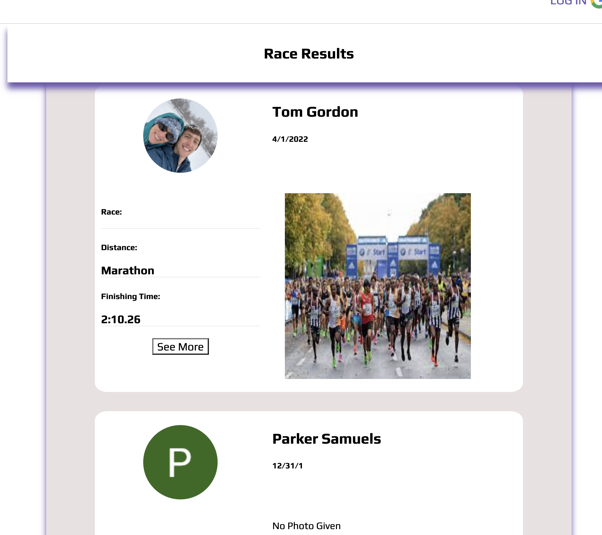

   <h1>:running_man: Keppa :running_woman:</h1>
   <h3>A Race Results Tracker</h3>
   <h5>Tom Gordon</h5>
   <a href='https://github.com/tom-gordon13' target='_blank'>
      
   <a href='https://www.linkedin.com/in/thomas-gordon13/' target='_blank'>
                                   
   <h1></h1>

<h1>App Description</h1>
<a href='https://keppa-sei.herokuapp.com/' target='_blank'>Click here to try out the app!</a>
 
 

Keppa is a MEN-stack web application that allows runners to upload and track results from various races. It builds off of the popularity of apps such as Strava, which bring a social media element to working out and competing so you can always stay connected.

 

<h2> :question: What is Keppa </h2>

 The Basics

| About Keppa |  |
|------------ | ------------|
| <h4 align='left'>Keppa is a web application that allows runners to track their race results across various distances. The word 'keppa' is Icelandic for 'compete', and tracking how you compete is what this app is all about!</h4> |  |
| <h4 align='left'>Similar in nature to <i>Strava</i>, Keppa is unique in that it focuses solely on competition results rather than individual workouts.</h4> |  |

 Getting Started

| Signing In |  |
|------------ | ------------|
| <h4 align='left'>Setting up an account with Keppa is as easy as signing into your Google account! Keppa uses Google's Open Authorization (OAuth) capability, which allows users to feel secure when signing into the app.</h4> |  |
| <h4 align='left'>Once you're signed in, you'll have full access to all of Keppa's features! And even if you don't have a Google account, you can still browse race results uploaded by other users.</h4> |  |

 Getting the Most Out of Keppa

| Browsing Results |  |
|------------ | ------------|
| <h4 align='left'>Start by browing all user results from the 'See All Results' tab. Click 'See More' if you want to see more details about a specific result! Your results will show up in this list, along with those of other Keppa users.</h4> |  |
| <h4 align='left'>On the lefthand side is a 'Summary' tab which displays a breakdown of results you have uploaded. Seeing nothing but 0's so far? Click on 'Add New Result' to show off your recent races!</h4> |  |

 Uploading to Keppa

| Submit Your First Result  |  |
|------------ | ------------|
| <h4 align='left'>In the 'Add New Result' page, you'll see a form that allows you to submit your own race result. Note that the Race Name, Race Date, Finish Time, and Distance fields are all required. Without them, your result will not submit properly! :(</h4> |  |
| <h4 align='left'>The form includes a few additional fields that allow you to give more details to other users. Do you know what place you got in the race? Was this an 'A'-focus race for you, or more of a 'C'-focus tune up? And best of all, have a photo you'd like to share? Feel free to drop in additional comments to tell other users how you felt!</h4> |  |

 Once You've Uploaded

| Commenting on Results  |  |
|------------ | ------------|
| <h4 align='left'>Once you've submitted your result, it will appears in the 'See All Results' tab as well as in your 'My Profile' view tab. Once you find your result, you can either click 'See More' to check out more details, or 'Delete Result' if you decide you'd rather not brag about this one.</h4> |  |
| <h4 align='left'>Once you click on 'See More' for a race, you and other users can add comments! Feel free to drop a congratulatory message on someone else's result, you know they'll appreciate it!</h4> |  |

 

## Technologies Used

 

 

<a href='https://trello.com/b/WM3kQyjG/project-2-board' target='_blank'>Click here for the original Keppa Trello board!</a>

 

## :hammer: Work in Progress  

### Keep an eye out for these exciting new features in the future!

- [ ] Add ability to follow specific runners   

- [ ] Add more detailed 'Summary Statistics' for a given runner  

- [ ] Add easier method to upload a race photo

- [ ] Add the ability to edit a race result once it's posted

- [ ] Add the ability to enter additional profile information

- [ ] Expand application to include/filter for multiple race disciplines (i.e. triathlons, open water races, bike races, etc.)
